# SDD 00: Phase 9 Image-Assisted Inventory Master Design

**Status:** `approved_baseline`
**Version:** 1.0
**Date:** 2026-07-19
**Phase:** 9
**Implementation:** WU0A contracts and the committed ingestion foundation reach one queued `vision_extract` job; the fixture-backed Unit 4 runtime and local M12 are fully corrected and verified for Git integration, while M11/M12 remain unapplied and all ingestion/vision services remain undeployed

## 1. Decision

Build Phase 9 as an AI-assisted, human-in-the-loop, deterministic inventory ingestion pipeline. A Store Owner uploads a same-language image of at most 15 book spines, receives enriched candidates, corrects a minimal review form, and commits candidates independently to private inventory and optionally to the public marketplace.

The vision model is not an autonomous agent. It cannot call metadata providers, storage, database functions, or application tools. The application owns authorization, orchestration, validation, retries, canonical matching, duplicates, commits, projection, media promotion, and lifecycle deletion.

## 2. Source and scope

This SDD refines DOC-1, DOC-3, DOC-4, DOC-5, DOC-6, DOC-8, DOC-13, and DOC-14. The detailed decisions are recorded in [the planning tracker](./trackers/01-planning-and-decisions.md), and the live delta is recorded in [database-current-vs-target](./supporting/database-current-vs-target.md).

### Included

- Owner-only scanning pilot.
- Camera and gallery upload.
- Same-language spine stacks, maximum 15 books/image.
- Multiple images in a simple Start/Close session.
- Persistent asynchronous extraction and enrichment.
- Model/provider adapter contracts and bounded fallback.
- Rich book metadata, up to three automated English alias proposals, and bounded official/Owner-verified aliases.
- Mandatory owner review, advisory duplicates, atomic per-candidate commit.
- Five public condition values plus separate damage disclosure.
- Public damage/actual-copy media and lifecycle management.
- Bookstore-first marketplace discovery and complete public store catalogue.
- Mandatory item-level customer current-copy photo request extension.
- Quota, cost, quality, security, privacy, retention, telemetry, and recovery.

### Excluded

- Mixed-language automatic routing, high-volume shelf scans, and per-spine model ensembles.
- Image similarity for duplicates.
- Automatic canonical creation or automatic duplicate merge from uncertain text.
- Automatic publishing without owner review.
- Full application translation/localization.
- Promotion/coupon engine and copy-level serialization for all inventory.
- Manager/staff scanning.
- Phase 7 payment, paid orders, refunds, ledger/settlement, and Phase 8 pickup behavior.

## 3. Design invariants

| ID | Invariant |
| --- | --- |
| MAS-01 | One accepted image is one selected-language batch with 1–15 visible spine candidates. More than 15 is rejected for rescan. |
| MAS-02 | Model/provider output is untrusted input. Only deterministic validated code can advance state or write data. |
| MAS-03 | Every store-owned row and media object is scoped by server-derived `store_id`; a client value cannot grant authority. |
| MAS-04 | Original-script title and author remain authoritative. Aliases are search-only and never duplicate/canonical evidence. |
| MAS-05 | Owner review is required before any candidate creates or increments inventory. |
| MAS-06 | No candidate failure blocks unrelated candidates; every candidate commit is atomic and idempotent. |
| MAS-07 | Private inventory and public marketplace data are separate. Only eligible server-projected fields become public. |
| MAS-08 | Scan, public-copy, and customer-request media are different security/lifecycle classes and cannot be repurposed by path reuse. |
| MAS-09 | Phase 9 can reach private inventory/public listing and request-photo acceptance only; it cannot create payment-provider or paid-order effects. |
| MAS-10 | Quota/cost failure never disables manual inventory entry. |
| MAS-11 | A valid private inventory commit survives public-projection failure; publication retries cannot create or increment inventory again. |
| MAS-12 | During the Owner-only pilot, the initiating Owner owns session mutation/resume. Phase 9 exposes no interactive support takeover or cross-store private-data access; recovery uses initiating-Owner retry, claimed-worker recovery, and reconciliation. Future support tooling requires separate design and authorization. |

## 4. Target architecture

```mermaid
flowchart LR
    Owner["Verified Store Owner"] --> App["Store Owner app"]
    App --> Gateway["Phase 9 command/query boundary"]
    Gateway --> Auth["Auth + store capability resolver"]
    Gateway --> Stage["Private media staging"]
    Stage --> Sanitize["Decode, validate, re-encode, EXIF strip"]
    Sanitize --> Jobs["Persistent orchestration jobs"]
    Jobs --> Vision["Vision adapter: primary / one fallback"]
    Vision --> Validate["Strict extraction schema validator"]
    Validate --> Canonical["Local canonical lookup"]
    Canonical --> Metadata["Metadata adapter: primary / secondary"]
    Metadata --> Candidates["Private staged candidates"]
    Candidates --> Review["Owner review and duplicate warning"]
    Review --> Commit["Idempotent per-candidate commit command"]
    Commit --> Inventory["Private store inventory"]
    Commit --> Projection["Safe listing projection"]
    Projection --> Market["Bookstore-first marketplace"]
    Commit --> PublicMedia["Approved public media"]
    App --> RequestMedia["Private customer request media"]
```

## 5. End-to-end workflow

1. Owner starts a session after the server verifies active Owner capability, entitlement/quota, feature flag, locality/store allowlist, and no conflicting session policy.
2. UI preselects selected language (English initially), condition, shelf/location, quantity 1, and publication preference. First-ever publication preference is private.
3. Owner captures or uploads an image. The app may do local guidance, but the server is authoritative.
4. Server creates a private media asset, validates signature/MIME/decode/size/pixels, re-encodes, strips metadata, hashes it, and checks replay/quota policy.
5. Quality gate checks blur, glare, resolution, framing, and count envelope. An image with more than 15 spines is rejected; it is never truncated silently.
6. A persistent job invokes the primary vision adapter with only the sanitized image, selected language, strict task/schema, and opaque correlation ID.
7. Output is schema-validated and bounded. A technical/schema/broad unusable failure may invoke one whole-image fallback. Valid empty/wrong-language results do not create retry loops. The fixture-backed first runtime persists immutable image/observation evidence and creates review candidates only for structurally valid observations matching the session-selected language. Mixed-language and unknown-language observations are retained as private evidence but skipped; more than 15 rejects the complete image.
8. Each observed candidate is looked up locally, then through sequential configured metadata providers if necessary. One coherent edition snapshot is selected.
9. One automated operation may propose up to three source-bearing English aliases after metadata selection; bounded provider-recognized or Owner/platform-verified aliases may coexist.
10. Owner reviews candidates, applies defaults, corrects only highlighted fields, adds a missed candidate/removes a false candidate, and chooses duplicate action and private/publish outcome.
11. Each candidate commit command re-authorizes the Owner/store, rechecks candidate/version/idempotency/duplicate/quantity/eligibility, then creates a new row or increments a compatible row and updates the safe projection.
12. Owner closes the session only when every input is terminal. The summary separates committed, published, private, needs-review, failed, and skipped candidates.
13. Lifecycle workers delete scan/raw/staged objects by policy and record deletion evidence. Committed inventory remains editable through controlled commands.

## 6. State ownership

### Session

`active -> closing -> closed`, with `expired` as a system terminal state. Leaving/backgrounding does not create a pause state. A close command fails with an owner-friendly “processing still running” result while any input is nonterminal.

### Input

`uploaded -> validating -> queued -> processing -> ready|failed|skipped`.

### Candidate

`processing -> ready|needs_review|possible_duplicate|failed -> commit_in_progress -> committed|failed`.

State labels shown in the UI may be simpler, but persisted values are versioned. State changes are server-owned and use expected version/idempotency.

## 7. Atomicity and consistency

- The session is not one giant transaction. External calls and owner review are persistent staged work.
- A candidate commit is the atomic business boundary.
- `create_new` atomically writes the private inventory, audit/event, alias/media links, and candidate commit linkage. Eligible publication is a separately idempotent projection step so its failure cannot erase or repeat the inventory effect.
- `increment_quantity` locks the compatible inventory identity and transfers only the intended quantity into `quantity_total` and `quantity_available`; existing reserved/sold/removed buckets remain unchanged.
- Duplicate check is repeated inside the commit transaction. The UI warning is not the concurrency guard.
- Projection failure returns `committed_publication_failed`, leaves inventory private, and retries publication idempotently without repeating the inventory write.
- Projection failure is explicit and recoverable; the API cannot report “published” while the public projection failed.
- A committed candidate cannot commit twice under a new client retry. Its stable candidate/action idempotency identity returns the recorded canonical result.

## 8. Reliability and fallback

- Persistent jobs use bounded claims/leases, retry classification, exponential backoff with jitter, and dead-letter/escalation.
- Retry only transient network, timeout, rate-limit, and safe provider failures. Do not retry invalid images, over-cap images, policy denials, or deterministic schema rejection without changing inputs/adapter.
- Vision fallback: one whole-image fallback maximum.
- Metadata: local cache first; configured primary then secondary only when no acceptable coherent match exists or a technical failure permits fallback.
- Manual correction/unmatched inventory is a successful path, not a terminal pipeline failure.
- Exact numerical timeouts/quotas are policy-configured. Implementation baselines are reviewed with provider limits and pilot measurements rather than embedded in schema/UI.

## 9. Security and privacy summary

The detailed model is in [SDD 04](./04-media-security-privacy-sdd.md). Cross-domain requirements are:

- backend-only provider/model credentials;
- no model tools, database credentials, signed URLs, store/customer PII, or raw internal identifiers;
- strict output validation and context-safe rendering;
- server-generated object paths and signed upload/download authorization;
- private scan/request buckets and approved-only public derivative promotion;
- EXIF/GPS stripping before model egress;
- provider DPA/training-reuse/residency review before production;
- no raw images/payloads/prompts/signed URLs in logs, Sentry, analytics, events, or audit metadata;
- RLS plus command-level authorization and cross-tenant denial tests;
- retention, legal/dispute holds, deletion evidence, orphan cleanup, and incident kill switches.

## 10. Observability

Record bounded metrics by store/policy/adapter version:

- image accepted/rejected and reason;
- candidate count, correction categories, missed/false candidates;
- extraction/provider latency, cache hit, fallback, error class;
- cost units and quota consumption;
- metadata match strength and unmatched rate by language;
- duplicate warning/action distribution;
- commit/private/publish/failure counts;
- cleanup backlog, deletion failures, orphan count;
- public search alias hit and no-result rate;
- requested-photo fulfillment time/failure/review rate.

Do not record raw images or unbounded raw model/provider text as telemetry.

## 11. Rollout

1. Recorded fixtures and migration/static tests only.
2. Internal test store with synthetic/consented images.
3. English single-store pilot, camera/gallery, private publication default.
4. English multi-store allowlist.
5. One consented language/script at a time using a documented fixture quality gate.
6. Public marketplace alias/search and damaged media.
7. Customer request-photo extension after the core Phase 9 commit path is stable.

Every stage has a global kill switch, adapter kill switch, store allowlist, quota controls, and manual-entry fallback.

## 12. Work-unit order

The normative unit order is in [the implementation tracker](./trackers/02-implementation-and-verification.md). Schema/contracts/security precede provider integration; owner commit precedes marketplace changes; customer photo requests follow the stable core commit/media boundary.

## 13. Documentation and development-session continuity

- Repository `AGENTS.md` is the mandatory new-session operating contract.
- `implementation/ACTIVE.md` routes to the active phase but does not own detailed status.
- DOC-13 owns global phase status; [TRACKER.md](./TRACKER.md) owns the Phase 9 milestone, active work unit, next authorized action, and gates.
- [SESSION-START.md](./SESSION-START.md) owns the ordered reading router, update matrix, and closeout transaction.
- Domain SDDs own behavior; trackers record status/evidence and cannot silently change requirements.
- The implementation tracker owns work-unit/test/migration/rollout evidence and its append-only session log.
- Any behavior/schema/security change updates its owning source/SDD/supporting documents in the same session.
- Every material session closes with an exact next authorized action, verification evidence, external-mutation statement, tracker updates, and continuity-validator result.
- Chat history, summaries, and old generic kickstart files are never completion or authorization evidence.

## 14. Acceptance criteria

| ID | Criterion |
| --- | --- |
| MAS-AC01 | All MAS invariants have automated contract/security coverage. |
| MAS-AC02 | A same-language 1–15 spine image can produce reviewed, independently committed candidates through recorded provider fixtures. |
| MAS-AC03 | Model/provider/storage/network failure cannot create unreviewed inventory or a false public-success response. |
| MAS-AC04 | Store A cannot access or affect Store B sessions, candidates, media, inventory, aliases, or request photos. |
| MAS-AC05 | Manual entry remains functional with image extraction disabled/exhausted. |
| MAS-AC06 | Public discovery uses only eligible safe projections and returns every eligible matching store. |
| MAS-AC07 | Retention/hold/deletion/orphan jobs are idempotent and observable. |
| MAS-AC08 | No Phase 7/8 behavior appears in migration, function, app, event, or test scope. |
| MAS-AC09 | Initiator-only session mutation/resume is enforced, interactive support intervention is absent, and worker/reconciliation recovery cannot grant cross-store private-data access. |
| MAS-AC10 | Publication failure retains one private inventory effect and no public listing until idempotent retry succeeds. |
| MAS-AC11 | Vision completion transactionally persists one immutable analysis result, preserves repeated positions, creates only expected-language review candidates, and cannot mutate metadata, inventory, or publication. |

## 15. Open review items

No product-blocking ambiguity remains. The following require implementation-time evidence rather than a product decision:

- model/provider selection and commercial/privacy contracts;
- pilot-measured language quality thresholds;
- exact quota/timeout/cache sizes;
- legal approval of 180-day completed request-photo retention;
- final bucket/table/function names after migration collision review.
