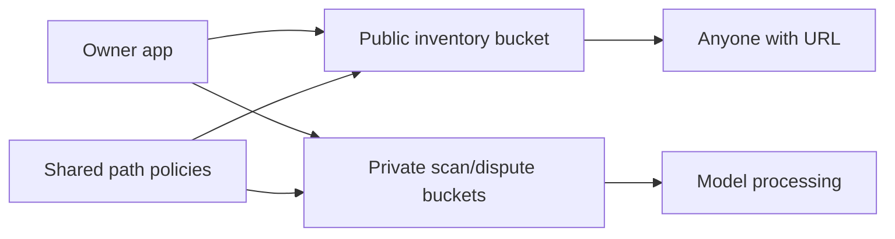
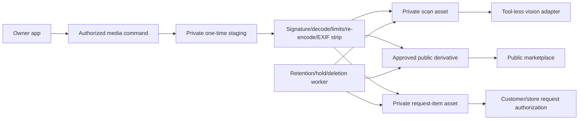

# SDD 04: Media, Security, Privacy, Retention, and Recovery

**Status:** `approved_baseline`
**Version:** 1.0
**Date:** 2026-07-19

**Unit 7/8 closure checkpoint (repository-only 2026-08-21):** M51 makes public
eligibility and media ordering one fail-closed boundary. Every link satisfying
the shared public-media predicate must have a unique non-null `public_order` in
`1..3`; link approval and later asset-lifecycle transitions are both guarded.
Pending/rejected links and private/staging assets may retain NULL ordering. M51
was not applied live.

**Live implementation checkpoint (2026-07-27):** M11/M12/M13, Owner Edge intake, and separate free-plan media/fixture-vision workers are live-verified. They enforce server paths, content-hashed completion, immutable service-only source snapshots/evidence, initiating-Owner/store/purpose/session/source binding, opaque token plus attempt fencing, repeated lease revalidation, re-encode/strip/hash, and canonical replay. M13 required no `SECURITY DEFINER` wrapper: current `service_role` grants safely support 13 postgres-owned, empty-`search_path`, fully qualified static `SECURITY INVOKER` delegates with execute revoked from all client roles. Detailed deployment and fixture evidence is in [tracker 06](./trackers/06-fixture-pipeline-deployment-evidence.md).

**Unit 4B local checkpoint (2026-07-27):** the Gemini adapter is implemented behind
the existing provider-neutral analyzer seam with server-only configuration, strict
structured output, bounded normalized usage/cost evidence, sanitized error classes,
and no raw prompt/response/image/credential logging. It has made no provider call
and is not deployed or selected in any live environment.
**Metadata retry security correction (live once 2026-08-10):** M38 adds
one postgres-owned, fixed-search-path private helper and replaces the existing
service-only public metadata-context wrapper. It exposes only a bounded claim
attempt number, grants no client execution, and does not widen table, payload,
credential, provider, store, or candidate access. Live readback confirms empty
`search_path`, postgres ownership, and postgres/service-role-only execution.
**Unit 7C M46 security checkpoint (live once 2026-08-16):** The bounded
private-Save correction gates append-only public revision insertion on the
server-derived `v_public_changed` value. M46 preserves postgres ownership,
`SECURITY DEFINER`, empty `search_path`, authenticated/service execution, and
anonymous denial for the Owner Save function. The exact M01→M46 disposable
proof and authenticated private-only Save reproof passed; no private field was
returned, no historical revision was rewritten, and no Edge redeploy occurred.
**Legacy Marketplace RPC security checkpoint (live once 2026-08-17):** M47
revokes `PUBLIC`, `anon`, `authenticated`, and `service_role` execution on
`phase9_storefront_catalogue(uuid,integer,jsonb)` and
`phase9_listing_detail(uuid)`. Pre-change role calls returned the full
projection-row shape including `inventory_id`; post-change calls fail with
`42501`. Repository search found no application or service dependency, and
the current v2 JSON discovery functions remain unchanged and callable by
customer roles. This applies the §9 rule that customer reads use bounded safe
commands/projections.
**Trusted-role compatibility follow-up (live once 2026-08-17):** M48 restores
only `service_role` `EXECUTE` on those two exact legacy signatures while
retaining `PUBLIC`, `anon`, and `authenticated` denial. Repository search, all
12 live Edge Functions, and the live SQL function-definition scan found no
caller; this is an intentional trusted-role compatibility allowance. Direct
projection-view access remains denied to customer roles, and v2 JSON RPCs remain
the customer path.
**Unit 6G lifecycle command checkpoint (live once 2026-08-29):** M54 preserves
the initiating-Owner/store boundary and adds one locked active-and-unexpired
session fence to the current final Save/Add/Remove RPCs after completed replay
reconciliation. Closed/closing/expired reads expose no mutation capability.
The new internal helpers are postgres-owned, fixed-empty-search-path, and denied
to `PUBLIC`, `anon`, `authenticated`, and `service_role`; public function
grants remain unchanged. Connected closed-candidate calls failed with
`P9_STATE_CONFLICT` and zero durable effects.
**U8B local security evidence (2026-08-20):** The repository-only M49 proof
keeps Q07 internal and customer-denied, grants Q08 only to the intended public
customer roles, and keeps the actual-copy helper service-role-only. The helper
and Q08 use `SECURITY DEFINER` with an empty `search_path`; real PostgreSQL
acceptance also verified the `extensions` pgcrypto placement, Q07 denial, Q08
allow, and absence of private `inventory_id` in the DTO. This is disposable
source/acceptance evidence only: no Supabase grant, function, Storage, Vault, or
database object was changed.
**Unit 7A security checkpoint (local, unapplied 2026-08-12):** M39 adds one
authenticated-only create command with server-derived Owner/store authority,
current candidate/review/metadata revision fences, fixed object qualification,
atomic audit/event/idempotency effects, and non-enumerating denials. It revokes
execute on the unsafe M05 commit signature from `PUBLIC`, `anon`,
`authenticated`, and `service_role` while preserving the legacy object. Local
PGlite proves cross-store/actor denial, rollback, replay/concurrency, canonical
immutability, and private media/listing isolation. Live ACL/RLS/function
readback remains pending because M39 is not applied. See
[tracker 29](./trackers/29-unit7a-create-only-commit-evidence.md).
**Unit 4B security correction (local, unapplied):** M14 registration is a
service-only atomic egress fence. It rejects stale/expired/superseded claims or any
job/reference/correlation, owner/token/attempt, store/session/input/media,
purpose/privacy/status mismatch before returning a private download handle and
before Gemini invocation. Attempt evidence excludes prompts, images, raw provider
responses, credentials, and raw lease tokens.
**M16 ACL correction checkpoint (2026-07-28):** M14
`vision_provider_attempts` and the three M15 persistence tables are confirmed
RPC-only mutation boundaries. Supabase default privileges nevertheless gave
`service_role` broad direct DML. M16 explicitly revokes all six mutation
privileges per table, preserves SELECT/RLS/ownership and fixed-search-path RPCs,
and was independently approved. M16 is live once as `20260727231217`, but
PostgreSQL 17.6 retained MAINTAIN (`service_role=rm/postgres`). The SELECT-only
boundary remains gated on a separately authorized forward M17 and live readback.

**M17 live ACL closeout (2026-07-28):** M17 is live once as
`20260727233457 marketplace_phase9_maintain_acl_correction`. PostgreSQL 17.6
readback proves `service_role=r/postgres` on the M14 provider-attempt table and
three M15 metadata tables: SELECT only, no MAINTAIN or direct mutation; RLS,
ownership, client denial, and 13 fixed-search-path RPCs remain intact. See
[tracker 10](./trackers/10-m17-acl-correction-evidence.md).
**M18/M19 live security checkpoint (2026-07-29):** M18 `20260729004216` and
M19 `20260729020008` are live once: RLS/client denial, service SELECT-only/
no-MAINTAIN, fixed-path RPC-only mutation/read, accepted-envelope replay
fencing, zero residue, and unchanged aliases/search passed. Unit 5C-5/5C-6 extends the same private/RPC-only/SELECT-only/no-MAINTAIN pattern to Owner decisions and rollout evidence; M24-M28 are live, anonymous/Owner private evidence access is denied, and M29 remains absent.
**Implementation checkpoint (2026-07-22):** the approved private-table, named-boundary, upload-capability, media-registry, and Storage boundary contracts are implemented in M02, M03, M05, M06, and M08 and pass isolated/live security checks. Forward M10 restores only the three anonymous discovery RPCs, makes the allowlisted projection invoker-safe, and removes direct role access; request-photo, internal-helper, and private-table boundaries remain closed. M01-M08/M10 are live-verified; M09/auth/runtime remain untouched.

## 1. Decision and evidence basis

Use a server-mediated media boundary: private staging and scan processing, approved-only public derivatives, and a separate private customer-request-photo domain. Treat every image, model response, metadata response, path, and signed URL as untrusted or capability-bearing data. Enforce authorization against the final store/entity identity and make deletion/hold behavior a persisted lifecycle, not a best-effort client cleanup.

I inspected the verified live Supabase project, relevant storage policies, bucket settings, inventory/listing policies and trigger, current advisor output, and the repository storage migration. The evidence supports structural containment rather than adding more client upload rules to the current shared bucket policy.

## 2. Observed, inferred, and proposed

### Observed

- `image-extraction-inputs` is private, 10 MB, JPEG/PNG/WebP.
- `inventory-photos` is public, 5 MB, JPEG/PNG/WebP.
- Shared marketplace policies allow active store administrators to upload/update/delete directly under a store-ID first path segment.
- Private reads include seller verification, order dispute evidence, and extraction inputs, with store-owner or selected platform-role access.
- `order-dispute-evidence` is private but is not customer request-item scoped.
- Legacy `listing-photos` is public, uses user-ID path ownership, and has a broad SELECT policy. Supabase advisor flags enumeration.
- Public buckets bypass download RLS for anyone holding the object URL.
- The current `photos text[]` inventory field has no purpose, approval, hash, retention, or deletion state.

### Inferred

- Direct owner writes to a final public bucket cannot prove server-side signature/decode/re-encode/EXIF controls before publication.
- Reusing a public object path for scan, damage, and request evidence would collapse incompatible privacy/retention rules.
- Store-path RLS alone does not authorize a customer to one request photo or prevent an owner from deleting active dispute/request evidence.
- Signed URLs are capabilities and can outlive auth changes until expiry; deletion is the reliable revocation action when immediate cutoff is required.

### Proposed

- One-time, purpose-bound upload authorization to private staging.
- Server validation and sanitized derivative creation.
- Separate scan, approved public-copy, private request-photo, and restricted dispute evidence purposes.
- Typed media registry/link tables and persisted deletion/hold state.
- No direct client promotion of unvalidated bytes to public inventory media.

## 3. Security invariants

| ID | Invariant |
| --- | --- |
| MED-01 | The server derives the final store/entity/purpose for every upload, read, promotion, link, and delete. |
| MED-02 | Store A cannot obtain an upload/download/delete capability for Store B media. |
| MED-03 | A customer can access only private request photos for their own request item and only during the allowed lifecycle. |
| MED-04 | Platform roles receive only the media purposes their function requires; finance/reviewer roles are not ambient media administrators. |
| MED-05 | Storage RLS is a backstop; command authorization is checked before issuing a signed capability. |
| MED-06 | No unvalidated upload becomes public or reaches a model/provider. |
| MED-07 | The model receives sanitized image data and no tools, secrets, PII, or reusable storage capability. |
| MED-08 | Model/provider output cannot construct a path, URL, query, command, or rendered active content. |
| MED-09 | Raw media/payloads/prompts/signed URLs do not enter logs, Sentry, analytics, events, notifications, or audit metadata. |
| MED-10 | Every object has a purpose-specific retention class, deletion state, and optional legal/dispute hold. |
| MED-11 | Public damaged-book media is deliberate, sanitized, approved, and limited to three images. |
| MED-12 | Customer request media is private, newly captured after the request, and limited to three images. |

## 4. Architecture options

### Option 1: Strengthen current direct bucket policies

Keep direct owner uploads and add more path/purpose conventions. This has the smallest migration, but validation still happens after the client has placed bytes in a final bucket, purpose can drift into filenames, public promotion remains easy to misuse, and request-customer authorization becomes policy-heavy. It is acceptable only as a short-lived compatibility bridge.

### Option 2: Server-mediated staging and purpose-bound promotion — recommended

The server authorizes one upload to private staging, validates/re-encodes it, then creates a purpose-specific media record and copies/promotes only a sanitized derivative. Public damage/copy images enter a final public bucket; request photos remain private and are served through a freshly authorized short-lived capability.

This adds a processing step and lifecycle worker but centralizes the controls most likely to drift: path ownership, file validation, EXIF removal, public/private classification, request linkage, and deletion.

### Option 3: Keep all media private and proxy every read

This provides the strongest uniform revocation/access control, but every public cover/copy read adds authorization/proxy/CDN complexity and cost. It becomes preferable if public actual-copy media later carries meaningful per-viewer restrictions. It is disproportionate for ordinary public listing images today.

| Dimension | Option 1 | Option 2 | Option 3 |
| --- | --- | --- | --- |
| Security | improves local policy but purpose drift remains | strongest proportionate boundary | strongest access control |
| Performance | lowest processing overhead | one upload processing/promotion step; public reads fast | every read authorized/proxied |
| Memory/storage | possible duplicate staging ad hoc | bounded sanitized derivative and lifecycle metadata | private origin plus proxy/cache burden |
| Reliability | fewer components but inconsistent validation | worker/retry needed; failures contained before publish | proxy becomes public availability dependency |
| Operability | policy sprawl | lifecycle/cleanup metrics required | highest service/CDN operations |
| Migration | smallest | moderate and reversible by feature flag | largest |

I recommend Option 2 under the current constraints. Option 3 should be reconsidered only if public copy photos become sensitive rather than public listing content.

## 5. Before and after trust boundaries





| Change | Before | After | Security consequence | Cost |
| --- | --- | --- | --- | --- |
| Upload authority | broad purpose through shared path | one-time purpose/entity capability | narrows confused-deputy/path abuse | command and staging flow |
| Public bytes | owner can upload final bytes | only sanitized derivative promoted | blocks unsanitized public content | processing/copy latency |
| Request access | dispute/store path oriented | request item/customer/store scoped | least-privilege evidence access | new link/state tables |
| Lifecycle | path/manual convention | persisted retention/hold/delete state | auditable cleanup/recovery | worker/alerts |

## 6. Upload validation

Server-side controls, following the [OWASP File Upload Cheat Sheet](https://cheatsheetseries.owasp.org/cheatsheets/File_Upload_Cheat_Sheet.html):

- allow only business-required JPEG/PNG/WebP inputs;
- do not trust extension or `Content-Type` alone;
- verify signature and decode safely;
- enforce configured byte, dimension, and total-pixel limits before full processing;
- generate random application filenames/paths;
- reject multiple/hidden formats and malformed decoders;
- re-encode to a known-safe derivative;
- strip EXIF, GPS, thumbnails, comments, and unnecessary metadata;
- reject animated/multi-frame PNG or WebP rather than selecting a frame implicitly;
- compute SHA-256 and record detected MIME/dimensions/bytes;
- enforce per-store/session/request image-count and rate limits;
- quarantine/delete failed inputs by policy and never publish them.

Implementation baseline should retain the live 10 MB scan limit and 5 MB public derivative limit unless measured pilot evidence justifies change. Pixel/dimension limits must be explicit in the implementation plan.

## 7. Storage and paths

Proposed logical buckets (final names require collision review):

- `marketplace-media-staging`: private, short-lived, no broad owner listing;
- `image-extraction-inputs`: private sanitized scan inputs;
- `inventory-photos`: public approved derivatives only, no broad listing policy;
- `order-request-photos`: private customer request media;
- `order-dispute-evidence`: restricted dispute artifacts, separate from ordinary request photos.

Paths are server-generated from immutable IDs, for example:

```text
<store_id>/<purpose>/<entity_id>/<media_id>.<ext>
```

The path is not the authorization record. The database media row and final linked entity/purpose are authoritative.

Supabase private bucket access must follow RLS or server-created signed access. Official references:

- [Storage access control](https://supabase.com/docs/guides/storage/security/access-control)
- [Private and public bucket behavior](https://supabase.com/docs/guides/storage/buckets/fundamentals)
- [Serving private assets and signed URLs](https://supabase.com/docs/guides/storage/serving/downloads)

## 8. Model and provider security

Multimodal image content can contain indirect prompt injection. The containment follows [OWASP LLM01:2025](https://genai.owasp.org/llmrisk/llm01-prompt-injection/) and [LLM05:2025](https://genai.owasp.org/llmrisk/llm052025-improper-output-handling/):

- no tools/function calling;
- no secrets or broad internal context;
- strict task and output schema;
- bounded candidate/string/array values;
- deterministic output validation and plain-text encoding;
- reject model URLs, commands, HTML/Markdown/SQL/path fields;
- parameterized database/provider operations constructed by code;
- human approval before inventory/public side effect;
- adversarial fixtures with visible/hidden image instructions;
- least-privilege provider worker identity and egress allowlist where supported.

Metadata-provider cover URLs are accepted only from configured HTTPS provider/host rules or through a reviewed image proxy/cache. Invalid/unsafe URLs fall back to an approved image or placeholder.

Provider provenance does not imply reuse permission. The adapter policy independently marks each normalized field as matching-only, storable, publicly displayable, image-cacheable, attribution-required, and expiry/revalidation-bound. Mobile clients cannot widen those rights.

The first fixture-backed vision runtime uses an opaque sanitized-media reference and a platform-owned resolver. Only that resolver can map the reference to private bytes; the analyzer never receives a bucket, object path, signed URL, capability, store/session/input authority, or credential. Canonical `p9-vision-v2` observations use positive allowlists and closed warning codes. Raw provider responses and prompts are not persisted; immutable evidence contains only bounded canonical fields and sanitized provider/model/version provenance.

Unit 5C Lite does not widen this boundary: its optional untrusted sidecar has no URL/path/capability/tool/query field or public authority, cannot invalidate extraction, and private scans remain ineligible as marketplace images. Unit 5C-1 enforces that boundary through strict unknown-key, byte, string, provenance, source-association, language/script, and proposal-limit validation without retaining raw provider output or enabling generation.
All vision transitions first prove the exact current job-row claim. If the input/session/media relationship is then missing or invalid, only that claimed job is resolved non-retryably with the bounded `P9_VISION_RELATIONSHIP_RECONCILIATION_REQUIRED` code and a hashed completing-claim fingerprint. No unverified related row is changed, the lease is cleared, exact replay is bounded and idempotent, and stale/conflicting attempts have no effect.

## 9. Authentication, tenancy, and grants

- Verify JWT at the server boundary.
- Resolve active Owner capability from server records; do not authorize from route/local storage/store ID.
- Resolve final media/session/candidate/inventory/request ownership in the same command.
- Every store-owned media/table row contains `store_id` and RLS.
- Customer request reads additionally bind `auth.uid()` to the order request/item.
- Phase 9 grants no interactive support takeover or cross-store private-data read. Recovery is initiating-Owner retry, claimed-worker recovery, and reconciliation; future support tooling requires separate action-specific design and authorization.
- Trigger/helpers are not executable by client roles.
- Callable RPC/Edge commands validate the actor internally, pin `search_path`, have explicit grants, and return bounded safe data.
- Service role remains server-only and is never accepted from the mobile client.
- Every new API-exposed table has RLS; raw attempts/jobs/usage/cost/lifecycle tables remain service-only.
- Revoke default `PUBLIC` privileges and default function `EXECUTE`; grant `anon`/`authenticated` only named minimum operations.
- Place privileged helpers outside `public` where practical, schema-qualify every reference, pin `search_path`, and deny direct client execution.
- Maintain one explicit table/function/role grant matrix; Owner/customer reads come from bounded safe commands/projections.

## 10. Privacy and vendor governance

- Shelf images may unintentionally contain people, addresses, documents, or location metadata; framing guidance and EXIF stripping reduce but do not eliminate this.
- Privacy notice must explain image processing by selected model/metadata vendors and operational retention.
- Send only the sanitized image and bibliographic clues necessary for the task.
- Vendor contract/DPA must prohibit training, marketing, or unrelated reuse unless a separately approved policy/consent exists.
- Complete cross-border/data-residency/subprocessor review before production extraction.
- Support data-principal/grievance/deletion handling through platform operations.
- Legal/privacy review must align retention with the applicable DPDP implementation timeline. Official source: [MeitY DPDP Rules 2025](https://www.meity.gov.in/documents/act-and-policies/digital-personal-data-protection-rules-2025-gDOxUjMtQWa).

## 11. Retention classes

| Class | Default | Hold/exception |
| --- | --- | --- |
| Failed/unattached staging | 24 hours | security quarantine with restricted access and explicit expiry |
| Scan input | within 24 hours after session close | active incident/security hold only |
| Raw model/provider payload | persistence disabled by default | separately approved, purpose-bound diagnostic capture only; mandatory deletion within 7 days |
| Unresolved normalized candidate | 30 days | explicit owner/platform review extension |
| Public damage/copy photo | listing active + 30 days | order/dispute/legal dependency |
| Unpaid/cancelled/rejected/expired request photo | 30 days | dispute/security/legal hold |
| Completed transaction request photo | 180 days | longer dispute/legal requirement; legal-review gate |
| Dispute evidence | resolution + 30 days or normal longer rule | legal/security hold |
| Audit/deletion metadata | at least 1 year baseline | policy/legal review; no image bytes/signed URL |

Retention values are policy data, not mobile constants.

Provider/model credentials and secrets cannot enter client and build bundles, prompts, fixtures, notifications, logs, telemetry, errors, documentation, Git, or model context. Non-secret provider and model identifiers remain permitted as bounded provenance and incident-correlation fields.

Raw provider/model payload persistence is disabled by default. Any exception requires separately approved, private, schema-bounded, positive-allowlist diagnostic capture that excludes credentials, secrets, signed URLs, reusable capabilities, PII, raw media, or unrestricted prompts/responses. Diagnostic records have a maximum seven-day deletion deadline and use idempotent deletion, bounded retries, alerts, and failed-deletion reconciliation.

## 12. Deletion, holds, and recovery

- Lifecycle worker selects due assets under lease, rechecks active links/holds, deletes object, then records `deleted_at`, reason, attempt, and object result.
- Deletion is idempotent; already-missing object is a success with evidence.
- Legal/dispute/security holds record type, authority, start/release, and prevent scheduled deletion.
- Orphan scan finds storage objects without valid media rows and media rows without objects; it never auto-deletes a potential held object without classification.
- Cleanup failures retry with backoff, alert at age/backlog thresholds, and expose an ops queue.
- Public deletion accounts for CDN propagation. Private signed URLs use short TTL; deleting the object is the revocation mechanism for urgent cutoff.
- Backup/point-in-time recovery can restore database metadata without restoring deleted object bytes. Recovery procedures must not silently republish private/expired media.

## 13. Logging, audit, and telemetry

Allowed:

- media ID/purpose/store ID (appropriately protected), bytes/dimensions/detected MIME/hash prefix where policy permits;
- validation result/code, adapter/version, latency/cost, lifecycle status;
- actor/action/entity/idempotency/outcome.
- for vision schema failures only, a code-owned sanitized field path plus one
  closed failure category; observation values, generated key names, and raw
  exception messages remain forbidden.

Forbidden:

- image bytes/base64;
- raw provider/model payload or full prompt;
- signed upload/download URL/token;
- provider secret/key;
- customer phone/address;
- unrestricted title/description in error telemetry;
- EXIF/location data.

Audit is append-only from normal clients and records sensitive reads/promotions/deletes/holds. Phase 9 defines no interactive platform override.

## 14. Abuse, moderation, and incident controls

- store/user/IP policy rate limits and quotas;
- exact replay protection and bounded retries;
- prohibited/counterfeit/pirated listing moderation remains before publication;
- content/decoder anomaly alerts;
- per-provider, per-language, per-store, and global extraction kill switches;
- ability to disable public media promotion while preserving private inventory/manual entry;
- vendor credential rotation and incident correlation by adapter/prompt/schema version;
- documented breach/incident escalation before production.

## 15. Validation plan

- cross-tenant Store A/B upload/read/promote/link/delete denials;
- customer A/B request-photo access denials;
- platform-role least privilege;
- traversal, forged path/store ID, MIME spoof, polyglot, malformed/decompression, over-byte/pixel, EXIF/GPS fixtures;
- public bucket enumeration denial;
- unapproved staging/scan/request objects never publicly downloadable;
- model image prompt-injection and malicious output fixtures;
- log/Sentry/event/notification privacy scans;
- signed capability expiry/final entity reauthorization;
- retention, hold, delete replay, missing-object, orphan, CDN/revocation behavior;
- advisor review after every DDL/storage change.
- unknown JSON key, integer overflow, negative money/quantity, malformed BCP 47, Unicode control/bidi, stale upload authorization, and cross-purpose media-ID denial;
- direct authoritative-table write, private-helper execution, `search_path` poisoning, and storage enumeration denial;
- publication failure/private survival, request-photo duplicate exclusion, pagination grouping, malformed public projection, worker double-claim/lease expiry, provider cost race, and cleanup-versus-hold race.

## 16. Acceptance criteria

| ID | Criterion |
| --- | --- |
| MED-13 | Uploads are authorized to a final store/entity/purpose and use server-generated paths. |
| MED-14 | Signature/decode/limits/re-encode/EXIF stripping occur before model egress or public promotion. |
| MED-15 | Only approved sanitized derivatives enter public inventory media. |
| MED-16 | Private scan and request media cannot be retrieved publicly or through another tenant/customer. |
| MED-17 | Model/provider credentials and service role are absent from the mobile bundle and model context. |
| MED-18 | Raw content and capability tokens are absent from logs/telemetry/events/notifications. |
| MED-19 | Retention/holds/deletion/orphan cleanup are persisted, idempotent, observable, and tested. |
| MED-20 | Post-migration Supabase advisor results are reviewed and every new notice is remediated or explicitly justified. |
| MED-21 | Phase 9 grant matrices revoke ambient privileges and prove authoritative operational tables/helpers cannot be directly used by client roles. |
| MED-22 | Provider fields are stored/displayed/cached only when adapter policy permits, with attribution and revalidation enforced. |
| MED-23 | Vision claim/context/persist/fail operations are service-only and validate job kind, store relationships, attempt, owner, token hash, and lease expiry before any effect. |
| MED-24 | Canonical image/observation evidence contains no raw response, prompt, media path/URL/capability/token, arbitrary provider metadata, or client-visible operational identifier. |
| MED-25 | Storage, public display, image caching, attribution, and revalidation are allowlisted per field and adapter/version before persistence or projection. |
| MED-26 | Query coalescing/cache reuse excludes secrets, raw media, PII, store-private fields, and policy-incompatible cross-store reuse. |
| MED-27 | Provider shadow evaluation and promotion require separately approved privacy, licensing, retention, cost, and access controls. |
| MED-28 | Provider/model credentials and secrets cannot enter client/build bundles, prompts, fixtures, notifications, logs, telemetry, errors, documentation, Git, or model context; non-secret provider/model identifiers remain permitted. |
| MED-30 | Unit 5C sidecar content is independently bounded/validated and has no tool, query, storage, inventory, publication, or public-media authority. |
| MED-29 | Raw provider/model payload persistence is disabled by default; any separately approved diagnostic capture is private, schema-bounded, positive-allowlist based, excludes credentials/secrets/signed URLs/reusable capabilities/PII/raw media/unrestricted prompts or responses, and is deleted within 7 days through idempotent deletion, retries, alerts, and failed-deletion reconciliation. |

## 17. Residual risk

No architecture can guarantee a multimodal model ignores every injected instruction or extracts every script correctly. The recommended design contains impact by giving the model no authority, validating outputs, requiring owner approval, and keeping commits server-controlled. Public image caching and legal retention are also operational risks; short private capabilities, deletion evidence, holds, and launch review make them manageable rather than invisible.

### 2026-08-09 M33 implementation alignment

The new reservation helper is owned by `postgres` and has no direct
`service_role`, `authenticated`, or anonymous execution grant. The existing
service-only media finalizer remains the only runtime caller and still enforces
the worker, attempt, lease-token, expiry, store, input, session, capability, and
sanitized-media fences before the helper can act. This closes the MED-23
cross-seam gap without exposing a new RPC or weakening M14 provider egress.
The helper and one-time repair additionally require an active session and bind
the sanitized media uploader to that session's initiating Owner, preventing
malformed historical state from being made provider-egress eligible.
